# InvestingWidget

Windows 데스크톱에서 항상 위에 떠 있는 미니 위젯. 암호화폐(현물/선물) + 미국 주식/ETF + 한국 주식/ETF의 실시간 가격을 표시합니다.

> **100% AI 바이브코딩 프로젝트** — 개발자가 요구사항·검수·빌드 환경을 담당하고, AI가 코드 정독·설계·구현·디버깅을 사전 승인 흐름으로 진행했습니다.

> 📦 **다운로드**: [Releases](https://github.com/Seober/InvestingWidget/releases/latest) 에서 `InvestingWidget-Setup-x.y.z.zip` 받아 압축 해제 후 안의 `.exe` 실행 (NSIS 마법사 진행). 자세한 설치 절차는 아래 "다운로드·설치" 섹션 참고.

## 주요 기능

- **항상 화면상단 + 프레임리스 + 투명**
- **마우스 휠** = 투명도 조절 (0.15 ~ 1.0)
- **좌클릭 드래그** = 위젯 이동
- **행 좌클릭** = 거래소/차트 페이지 새 탭 열기
- **우클릭 메뉴**: 항목 관리[추가·목록 편집], 갱신 간격, 설정, 항상 위, 자동 시작, 종료
- **자동완성 드롭다운** — 한글 종목명·티커·암호화폐 이름 검색 (250ms debounce, 키보드 nav)
- **중복 등록 차단** — 같은 자산·심볼·quote 조합 재등록 시 알림
- **목록 편집** — 드래그로 순서 변경, 체크박스 일괄 삭제, 행별 편집
- **자기치유 폴링** — WebSocket 침묵 시 REST 백업 호출로 자동 복구
- 종료 후 재시작해도 위치·항목·갱신주기·투명도·항상 위 모두 복원
- **갱신주기 변경** (WebSocket 푸시 기반, 100ms~5s 변경 가능)

## 데이터 소스

| 자산 유형              | 소스                                            | 인증                                                         |
| ---------------------- | ----------------------------------------------- | ------------------------------------------------------------ |
| 암호화폐 현물          | Binance · Gate.io WebSocket                     | 불필요                                                       |
| 암호화폐 선물 (USDT-M) | Gate.io WebSocket (KR IP에서 Binance 차단 회피) | 불필요                                                       |
| 미국 주식 / ETF        | Finnhub WebSocket                               | **API 키 필요** ([finnhub.io](https://finnhub.io) 무료 발급) |
| 한국 주식 / ETF        | TradingView WebSocket (비공식)                  | 설정에서 옵트인. 실험적, 깨질 수 있음                        |

자동완성 보조 소스: Naver Finance autocomplete (한국 종목명/코드), Yahoo Finance search (미국).

## API 등록 방법

### 미국 주식·ETF — Finnhub API 키 발급·등록

1. **발급**: [finnhub.io](https://finnhub.io) 회원가입 (무료) → 대시보드의 **API Key** 항목에서 키 복사
2. **등록**: 위젯에서 **우클릭 → 설정** → "Finnhub API 키 (미국 주식/ETF용)" 입력란에 붙여넣기 → **저장**
3. 저장 즉시 어댑터에 반영되며, 이후 미국 주식·ETF 항목 추가 시 자동으로 사용됩니다.

> 무료 플랜은 분당 60건 제한이 있으나 위젯의 WebSocket 사용량은 그 안에 들어갑니다.

### 한국 주식·ETF — TradingView 어댑터 활성화

1. **우클릭 → 설정** → "TradingView 어댑터 활성화 (한국 주식, 비공식 — 실험적)" 체크 → **저장**
2. 별도 API 키는 필요하지 않습니다.
3. 비공식 엔드포인트라 라이브러리·엔드포인트 변경 시 멈출 수 있습니다. 멈추면 토글 OFF.

### 암호화폐

별도 등록이 필요하지 않습니다. Binance·Gate.io의 공개 WebSocket을 그대로 사용합니다.

## 시작하기

### 다운로드·설치 (사용자)

1. [Releases](https://github.com/Seober/InvestingWidget/releases/latest) 에서 `InvestingWidget-Setup-x.y.z.zip` 다운로드
2. 압축 해제 → 안의 `.exe` 더블클릭 → NSIS 마법사 진행:
   - **설치 모드**: 현재 사용자 전용 (관리자 권한 불필요)
   - **설치 경로 선택** (default `%LOCALAPPDATA%\Programs\InvestingWidget`) — 다른 경로 선택 시 끝에 자동으로 `InvestingWidget` 디렉토리가 추가됨
   - **Components 페이지**: 바탕화면 바로가기·시작메뉴 바로가기 체크박스 직접 선택
3. 설치 완료 후 자동 실행. 이후 시작메뉴/바탕화면 바로가기로 실행

> **첫 실행 시 SmartScreen 경고** ("Windows에서 PC를 보호했습니다"): 코드 서명 인증서가 없어서 경고가 뜰 수 있습니다. **추가 정보 → 실행** 으로 진행하세요. 한 번 설치 후 자동 업데이트는 SmartScreen 영향 X (electron-updater 가 직접 다운로드).

### 개발 모드

```bash
npm install
npm run dev
```

### Windows .exe 빌드 (개발자/contributor)

```bash
npm run package:win
```

산출물 (`release/`):

- `InvestingWidget-Setup-x.y.z.exe` — NSIS 인스톨러 (자동 업데이트 backbone)
- `InvestingWidget-Setup-x.y.z.zip` — `.exe` 의 zip wrapper (Edge SmartScreen 다운로드 차단 우회용)
- `latest.yml` — electron-updater manifest (자동 업데이트 진단용)
- `InvestingWidget-Setup-x.y.z.exe.blockmap` — delta update 청크

WSL/Linux 빌드 시 `wine` + `wine32` 필요 (NSIS makensis 가 32-bit 바이너리). Native Windows 빌드는 GitHub Actions 의 `windows-latest` runner 가 처리 (`.github/workflows/release.yml`) — tag push 시 자동 release 발행 (zip wrapper 도 자동 첨부).

## 사용 방법

1. 위젯이 화면 우상단에 뜹니다.
2. 우클릭 → **항목 관리 → 항목 추가**
3. 자산 유형을 선택하고 입력 (자동완성 활용):
   - 암호화폐: `BTC`, `ETH` 등 — 자동완성에 Binance·Gate.io 페어 노출 (Quote 기본 `USDT`)
   - 미국 주식/ETF: `AAPL`, `SPY` 등 — Finnhub API 키 등록 필요. Yahoo로 자동완성
   - 한국 주식: `삼성전자`, `005930`, `KOSDAQ:091990` 모두 가능. Naver autocomplete로 한글 검색
   - 한국 ETF: `KODEX 200`, `069500`, `0023A0` (영숫자 신규 ETF 코드 지원)
4. 추가 시 시세 1건 수신해야 등록됩니다 (잘못된 티커는 거부).
5. 행을 좌클릭하면 거래소/차트 페이지로 이동합니다.
6. 마우스 휠로 투명도 조절, 좌클릭 드래그로 이동.
7. 항목 일괄 정리: 우클릭 → **항목 관리 → 목록 편집** (드래그 reorder, 체크박스 일괄 삭제, 행별 편집)

## 종목명 옆 표시

행마다 종목명 뒤에 작은 표시가 붙을 수 있습니다.

| 표시  | 조건                                     | 의미                                   |
| ----- | ---------------------------------------- | -------------------------------------- |
| `(f)` | 암호화폐 선물 자산                       | 현물과 구분 (futures)                  |
| 🔑    | 미국 주식·ETF + Finnhub 키 미등록        | 위 "API 등록 방법" 참고                |
| ⚠     | 한국 주식·ETF                            | TradingView 비공식 어댑터 — 실험적     |
| ⏳    | 어댑터 재연결 중                         | WebSocket 복구 시도 중, 잠시 후 사라짐 |
| ⏸     | 어댑터 침묵 (자기치유 폴링도 회복 못 함) | 거래량 매우 적거나 잘못된 심볼 의심    |

행에 마우스 오버하면 시세 출처(Binance Spot, Gate.io Futures, Finnhub, TradingView 등)가 툴팁으로 표시됩니다.

## 자동 업데이트

앱 시작 후 약 10초 뒤 백그라운드로 새 버전을 자동 체크합니다 (GitHub Releases 의 `latest.yml` 사용).

- **새 버전 발견 시**: native dialog "새 버전 v{X} 발견 — 다운로드?" → 동의 시 progress modal 띄움 (다운로드 % · 전송량 · 속도 표시) → 완료 후 재시작 confirm dialog
- **수동 trigger**: 우클릭 → **업데이트 확인…** — 결과 없으면 "최신 버전입니다" 알림
- **progress modal 닫기**: 백그라운드 다운로드 계속, 완료 시 native dialog 가 안전망으로 다시 confirm
- **재시작 동의 안 함**: 자동 적용 X — 다음에 수동 체크 또는 재실행 시 자동 체크 시 재발화

> **자동 업데이트는 v0.5.0 부터 도입**. v0.4.0 이하 zip 사용자는 v0.5.0 `.exe` 인스톨러로 한 번 재설치 필요 (config 는 자동 보존 — 같은 `%APPDATA%\investing-widget\config.json` 사용).

## 한국 주식·ETF 사용 시 주의

TradingView WebSocket은 **비공식 엔드포인트**입니다. 라이브러리·엔드포인트가 변경되면 한국 주식·ETF 행이 멈출 수 있습니다. 깨지면 설정에서 토글 OFF하세요. 안정적인 실시간이 필요하면 한국투자증권 KIS Open API 어댑터로 마이그레이션 가능합니다 (현재 미구현).

## 설정 파일 위치

- Windows: `%APPDATA%\investing-widget\config.json`

## 시스템 아키텍처



```
src/
├─ main/             Electron 메인 프로세스 (윈도우, IPC, 영속화, 메뉴)
│  └─ priceService/  Binance / Gate.io / Finnhub / TradingView 어댑터
├─ preload/          contextBridge로 IPC를 렌더러에 노출
├─ renderer/         React UI (Zustand, 모달, 행 컴포넌트, 자동완성)
└─ shared/           메인/렌더러 공용 타입과 IPC 채널 상수
```

## 알려진 한계

- **저거래량 토큰 콜드스타트 지연** — 앱 재실행 시 거래량 적은 토큰(예: NUMI)이 ~15-30초 늦게 표시 (IPC race; 해결안 도출됐으나 미구현)
- **자동완성 prefix-only** — Naver autocomplete가 한글 중간 키워드 매칭 미지원 (`양자` 입력으로는 매칭 안 됨, 첫 단어부터 입력 필요)
- **TradingView 비공식 엔드포인트** — 안정성 보증 없음, 깨질 수 있음
